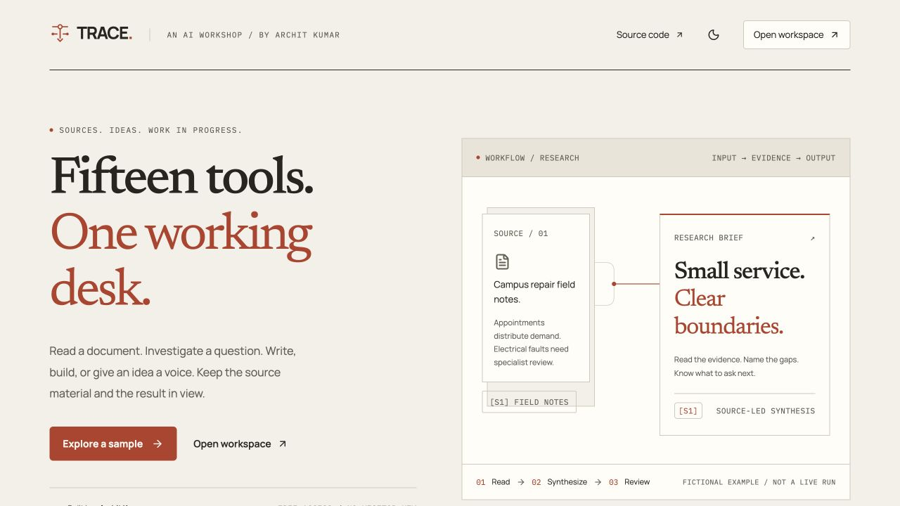

# TRACE public launch — 9 October 2026

**Live website:** https://trace-agentic-workspace.vercel.app

**HTTPS API:** https://trace-api.34.93.169.35.sslip.io

**Deployed backend source:** `3529b105ffee12b5b90858f8d625f2cde19e8b05`

**Review branch / draft PR:** [TRACE migration PR](https://github.com/Archit-k20/Agentic-Workflows-GenAI-/pull/1)

The site is reachable without a Vercel account or visitor API key. The approved editorial frontend is unchanged. Being live is separate from full output-quality acceptance: the current hosted follow-up is provider-blocked and some remaining acceptance checks are listed below. No paid account upgrade, OpenAI request, quota reset or merge occurred.

## Seven delivery tasks

| Task | Status | Evidence and remaining scope |
| --- | --- | --- |
| 1. Reproducible model/runtime installation | Complete | Exact original Qwen manifest and all immutable blobs downloaded into an empty volume, hash-verified, then exercised with real CPU inference. BGE/FAISS recovery and Kokoro decoded MP3 passed. No mutable-tag substitution. |
| 2. Hosted Llama/code quality review | Partial | Earlier profile completed 60/60 real hosted cases without fallback/errors. Source-based review failed on unnecessary support escalation and unsupported wording. Corrections are deployed; changed-profile follow-up was refused by Cloudflare. Retest affected cases, then the full profile deliberately when capacity permits. |
| 3. Local fallback quality/capacity | Partial | Public summary fallback and cited Q&A work. Prior content targets completed but source review failed on arrival-versus-shipping language. New guards are regression-tested; both VM targets completed in 621.92/552.92 seconds without execution errors. Targeted date/evidence wording improved, but full quality acceptance remains failed: review quality, omitted owner details and duplicated conditions need attention. This is not a full local quality or concurrency pass. |
| 4. Provision the full Python/model host | Complete | Google trial VM, persistent private volumes, compilers, Tesseract, pinned BGE/Kokoro/Qwen, HTTPS, owner-only SSH and private application/model ports. Retention at most 24 hours. |
| 5. Publish Vercel and connect production | Complete | Stable public URL, real Turnstile keys, exact CORS/hostname allowlists, public Vercel access, no frontend owner secrets. Default free mode. |
| 6. Public integration verification | Partial | 18/18 HTTP wiring checks; real browser speech playback, fallback summary, five samples, evidence inspection; actual PDF/index/OCR/caption/audio transport, two-session isolation and restart recovery. All fifteen adapters and branch behavior are automated-test covered; all fifteen real public AI outputs are not yet accepted. |
| 7. Release record and interviewer rehearsal | Partial | Draft PR/checks and deployment/recovery instructions updated; approved design preserved. Independent phone/mobile-data verification, final quality gates and representative capacity/performance checks remain. No merge implied. |

## Verified on the public deployment

- A real browser opened the recruiter URL without a Vercel login, received successful managed Turnstile verification and generated playable speech. Short Heart-voice speech took about 15 seconds in this browser run. One subsequent public FLUX request returned HTTP 400. A separate, deliberately reserved diagnostic with the documented prompt/steps fields returned HTTP 429/code 4006 (free allocation exhausted). The first response body was not retained, so its HTTP 400 cause is unconfirmed. No successful public image is claimed today. The request now omits undocumented width/height fields, and input failures finish the image stage explicitly; the earlier image integration was not silently counted as passing.
- A free summary attempted hosted inference, showed an explicit provider-unavailable/local-fallback warning and returned a usable synthetic summary in about 64 seconds. It did not automatically replay the request or replace the output with a sample.
- The public command menu opened with ⌘K, filtered Speech Studio by typed search, opened it with Tab/Enter and closed with Escape. This focused keyboard check is not every-control accessibility acceptance.
- All five synthetic samples displayed **Sample result — no live AI request** and rendered their respective outputs. Research evidence could be pinned into the inspector.
- Research sample with its evidence inspector had no horizontal overflow at 360, 768, 1024, 1440 and 1920 px, in both themes. This ten-check subset does not replace every-tool, every-state responsive testing. Earlier broader local UI checks remain historical evidence for the unchanged frontend.
- Public HTTPS transport accepted a real synthetic PDF, built a BGE/FAISS context, extracted a generated scan using actual Tesseract and preserved an explicitly pasted caption. Generated MP3 MIME/body and owner retrieval were checked.
- A different session could neither retrieve the audio (404) nor query the first context (workflow error with no result/source). For context queries, HTTP 200 carries the SSE error; do not assume every ownership failure is HTTP 404.
- The API was restarted. Persisted audio remained accessible and context retrieval still supplied actual sources. The initial Q&A answer assertion failed and its full response was not retained; its cause is unresolved. A separate recorded follow-up after restart returned the supported owner/count/date answer with [S1], actual chunk text, in 33.97 seconds. The earlier failure is preserved rather than erased. Both checks used temporary owner-issued test sessions; they did not bypass protection on the running API. Browser anonymous entry was proven separately.
- Synthetic test sessions were cleared and their tokens then rejected. Production protection remains enabled.

One actual official Python URL extracted 2,307 readable characters from the VM in 0.36 seconds, with no AI request; only metadata/hash are retained. This does not establish arbitrary website or YouTube access.

The VM content benchmark ran on `38a1c8d`, immediately before the image-only `0d37320` patch. Both cases completed but took 621.92/552.92 seconds; date/evidence errors improved, while self-review, omitted owners and duplicated refund conditions keep full local acceptance open. The recorded fingerprint is not relabeled. See [raw VM outputs](evaluation/vm-local-launch-targets-2026-10-09.json) and [source-based local review](evaluation/vm-local-launch-review-2026-10-09.json).

Machine-readable evidence: [HTTP wiring](evaluation/public-wiring-2026-10-09.json), [first runtime checks including the failure](evaluation/public-runtime-2026-10-09.json), [separate Q&A follow-up](evaluation/public-qa-followup-2026-10-09.json), [image diagnostic](evaluation/public-image-diagnostic-2026-10-09.json), [actual URL extraction](evaluation/vm-url-extraction-2026-10-09.json), [sampled resources](evaluation/vm-resource-samples-2026-10-09.json).

## Automated validation and quality limits

The deployed `0d37320` source passes **217 backend tests** locally and on the AMD64 VM, with [native ARM64/AMD64/frontend CI](https://github.com/Archit-k20/Agentic-Workflows-GenAI-/actions/runs/37913118897), including all fifteen adapters, original OpenAI workflow parity, isolation/persistence, source guards, real five-language compilation/syntax checks and failed/unavailable verification branches. The VM test process uses `TRACE_PUBLIC_DEPLOYMENT=false` solely for TestClient fixtures; the production API continues to require Turnstile. Real public missing-proof rejection is a separate passing check.

[Native ARM64/AMD64 and frontend CI](https://github.com/Archit-k20/Agentic-Workflows-GenAI-/actions/runs/37910961377) is green for the deployed backend source, including real pinned CPU model smoke checks. Fact presence, model self-review and successful compilation are not factual, behavioral or security certification. [Source-based hosted review](evaluation/launch-review-2026-10-09.json) records why the earlier sixty-case run did not pass acceptance. Its fingerprint must not be relabeled as the current corrected profile.

## Hosting and recovery

The frontend runs on Vercel Hobby. The backend runs on Google **Compute Engine**, not Cloud Run: `trace-api`, Mumbai `asia-south1-a`, Ubuntu 24.04 AMD64, N2 standard 4 vCPU/16 GB, 50 GB disk, reserved public IP. Caddy serves verified HTTPS and proxies directly to the private API. Ollama has no public endpoint. API and model limits are 3 GB/2 CPUs and 8 GB/2 CPUs respectively. Named volumes persist model files, SQLite, contexts and artifacts.

This uses Google **Free Trial credits**. The observed end date is **8 January 2027**, or earlier credit depletion. It is not permanently free hosting; do not upgrade to paid billing. Check Billing credit and plan before relying on availability. [Google trial rules](https://cloud.google.com/signup-faqs). The full backend cannot run unchanged inside Vercel Hobby functions; see [deployment and recovery instructions](deployment.md).

During active local content generation, observed Ollama usage was approximately 3.8–4.0 GiB and API usage 310 MiB; no container OOM kill/restart was observed. These are snapshots, not a measured peak or two-heavy-workflow stress pass.

Private production recovery configuration is saved in ignored `backend/.env.production` locally (mode 600) and root-owned `backend/.env` on the server. Do not attach, print, commit or upload those files into a public project. Disposable test-model containers/volumes and duplicate temporary credential/ledger files were removed; existing development containers were preserved.

## Remaining acceptance checks

1. When Cloudflare accepts a deliberate controlled request, retest the seven affected fixtures on the corrected profile and complete a fresh full hosted benchmark with source inspection. Keep the shared allowance intact; do not spend it on automatic polling or enable paid overflow.
2. Inspect current-profile VM local content results and fix any confirmed source errors before calling local quality accepted. Record actual latency and sampled memory separately from stress certification.
3. Exercise remaining real public tool paths with varied inputs: DOCX, real URL/article Q&A/research/support, available YouTube transcript and readable fallback, code repair, document analysis/content/narration, and a minimal generated image with visual review. Existing integration/mocked tests are not these live checks. No paid advanced-mode acceptance is claimed without an explicit test key; its legacy DistilBART model cache has not been warmed or exercised on the public host.
4. Verify browser file selection on a real phone/browser. The in-app browser filechooser automation did not open a chooser; API uploads worked. Do not interpret a backend upload pass as a browser file-picker pass.
5. Check independent mobile-data access and playback, two concurrent workflow memory/latency, long uploads/reports, reduced motion, keyboard use and deployed representative performance. No field LCP/CLS/INP certification is claimed.
6. Rehearse a short live interview workflow with available hosted capacity; keep labeled samples as a clearly identified fallback. Avoid running the full benchmark immediately before the interview. Review the draft PR before any merge.

## Image fallback follow-up — 9 October 2026

The own private HF ZeroGPU worker is now published and enabled on production.
Cloudflare remains primary; only known image capacity rejection triggers one HF
submission. The read token alone is installed on the server/Space. The write token
stays local, and the mode-600 recovery configuration is updated. The existing
visitor allowance is unchanged at two images per visitor/network per UTC day.

Two real pinned FLUX images succeeded, including the actual VM SSE/artifact
integration in 9.656 seconds with session isolation/clear verified. A simple cube
illustration matched the prompt; the earlier teapot test had a malformed handle.
[Evidence](evaluation/hf-production-2026-10-09.json) and
[setup/limits](huggingface-images.md) distinguish operator proof from public UI proof.
The public browser passed automatic verification but hit the existing network
image allowance. Complete that one run after reset; no production quota was
changed. HF also has an independent limited owner allowance, so this extends
availability without unlimited generations or a latency/accuracy guarantee.

The new backend has 245 passing tests locally/on the deployed AMD64 VM and
[green frontend/native AMD64/ARM64 CI](https://github.com/Archit-k20/Agentic-Workflows-GenAI-/actions/runs/37924817983).
The 18 public HTTP wiring checks pass. The frontend deployment is
`dpl_F5FMTnrKFjsTapNzd2UroSWL6stA`; provider disclosure changed, design did not.
Earlier launch evidence remains attributed to its original commit. All broad
quality, device and performance acceptance checks above remain open.
