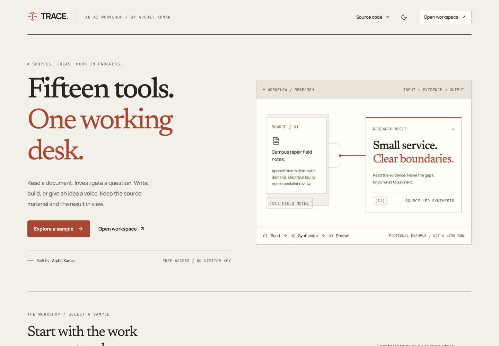
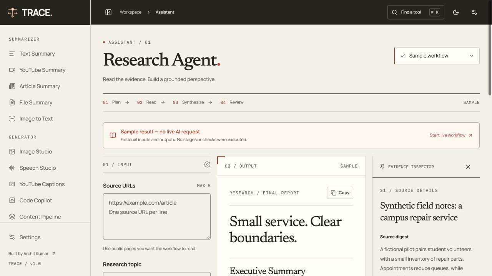
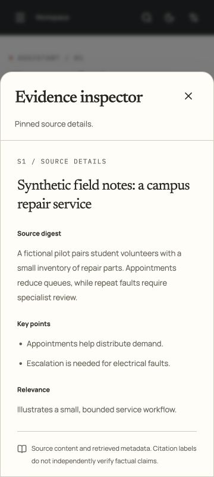
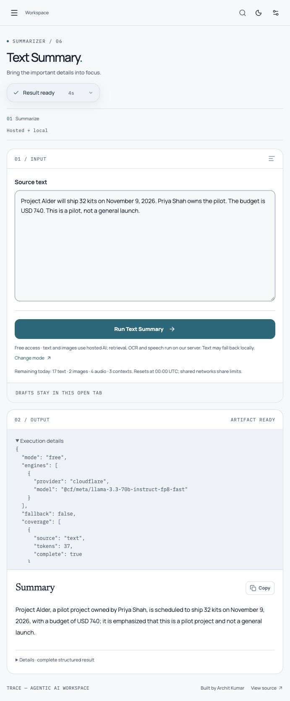
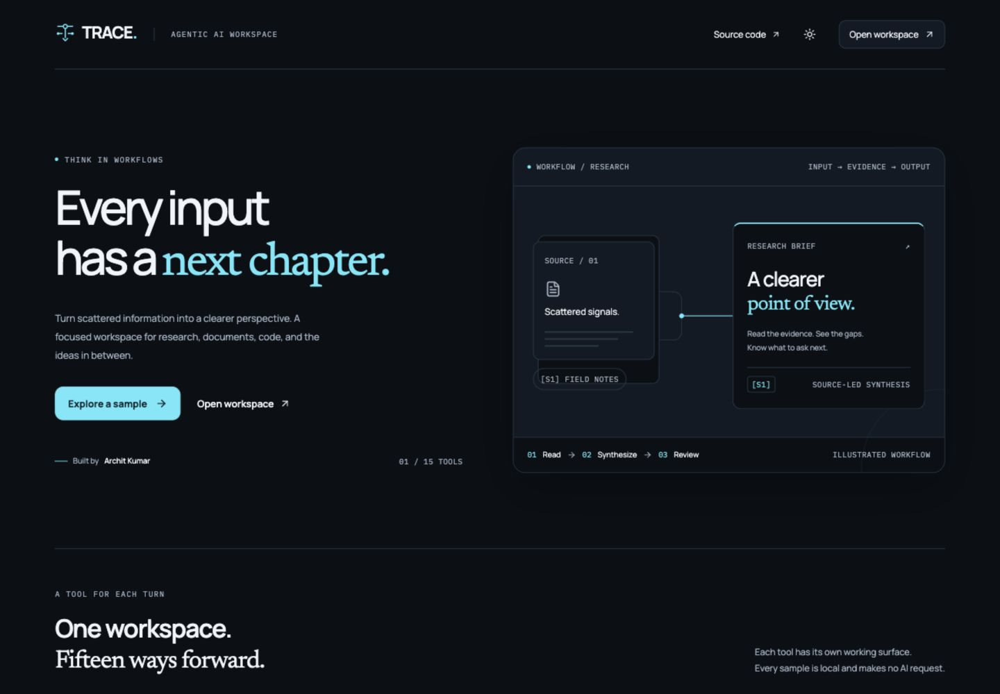
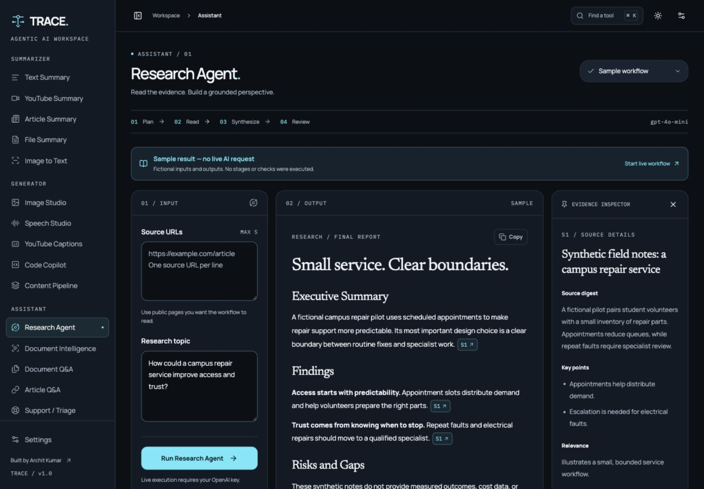
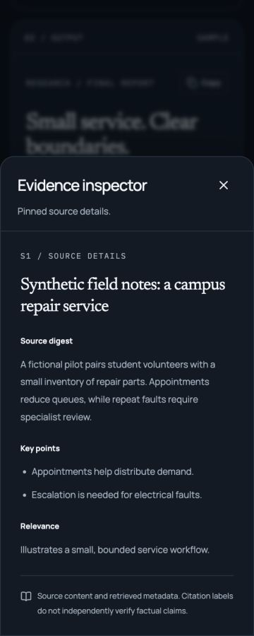

# Interview launch verification — 8 October 2026 IST

**The website is not published and launch acceptance is not yet passed.** Cloudflare answered a bounded Llama probe today (HTTP 200, 39 input / 2 output tokens). This confirms availability at that time, not the cause of the 4 October dashboard/API mismatch or unlimited capacity.

- The earlier correction profile completed **60/60 hosted cases**, with 54 Llama / 6 Qwen Coder results, no errors/fallback, 88/88 expected facts present, 10/10 missing-answer refusals, 6/6 syntax checks, 4/4 required escalations and 2/2 supported Support answers. All output transport schemas validate. **Quality acceptance failed:** content invented presenter/innovation/purpose claims, and grouped citations did not produce individual evidence links. Fact presence is not accuracy.
- Seven separate hosted boundary cases passed their expected refund routing, receipt requirement, conflict escalation, explicit assignee and material-detail screens on that earlier profile. Diagnostic model fields are not universally accurate.
- Free-mode source checks now cover the observed role/promotional/purpose/audience phrases; valid grouped citations become individual evidence links. A fresh intermediate run completed six cases and then stopped at TRACE's conservative daily text reservation ceiling. It still exposed audience/purpose inventions, leading to the final guard changes. **A complete hosted run of the final profile remains pending; do not mix or resume different fingerprints.** No limit bypass/reset or paid overflow.
- The current native ARM64 Docker image rebuilt and **192 backend tests passed**, including parity, five actual language checks, ownership/persistence, compression limits and public wiring checks. Eight frontend tests, TypeScript and production build passed; UI unchanged. Current-commit native AMD64/ARM CI outcomes must be checked on the PR.
- A real official Python article extracted nonempty text in 2.42 s after bounded gzip/deflate support was added. Both wire and decoded data are capped at 8 MB, including concatenated gzip. This extraction check makes no AI request.
- Two real final-profile CPU content cases completed in **353.15 s and 234.19 s**, with 4/4 expected facts and valid transport. **Local quality remains failed:** unspecified guarantees became asserted absence, and an owner was described as overseeing shipment without an explicit assignment. Failed review details remain visible; repeated verbatim restoration is also a polish issue. These two cases are not a full local acceptance run. Model cache unloaded after generation; restarted local API reports ready.
- Added `python -m backend.deployment_check` to check HTTPS/CORS/capabilities/default free mode/visitor-proof rejection **without inference**. It has not run against a public deployment; none exists. Successful browser Turnstile, live media, real inputs, two-user isolation, restart recovery, server capacity/latency and deployed performance remain launch gates.

Raw results, fingerprints, source-based review and limitations: [current evaluation evidence](evaluation/README.md). Hosting options and owner steps: [deployment guide](deployment.md). The owner is comparing alternatives to Oracle; no hosting purchase/provisioning, production publication or merge has occurred. Owner Cloudflare credentials remain private on the backend; visitors need no provider key.

---

The sections below are historical records; newer counts/status above take precedence.

# Dashboard/API quota discrepancy — owner evidence, 4 October 2026 IST

The owner supplied a dashboard showing **5.56k / 10k Neurons used today**. The selected **Last 24 hours** chart separately totals 11.13k text Neurons (6.22k Llama) and 172.8 image Neurons. The chart spans two dates and must not be treated as today's allowance consumption. This conflicts with the provider's daily-allocation-exhausted message below; account-wide daily exhaustion is therefore **not independently confirmed**.

One bounded eight-token diagnostic at 05:42:40 UTC still returned HTTP 429 / code 4006. Recorded diagnostic IDs: CF Ray `a451dd58afccaa33-DEL`; AI request `1389f7db-e419-47a0-b895-f5bdb3c628ad`. The owner confirmed the dashboard account matches the ignored backend account configuration. A provider quota/reporting or entitlement discrepancy is a hypothesis, not an established cause. Cloudflare documents daily reset at 00:00 UTC; no confirmed rolling-window explanation was found in its official documentation. A reset does not guarantee recovery of this mismatch. Check availability deliberately before resuming tests; no repeated polling/model requests or paid upgrade is needed to diagnose it.

The correction commit **5073a65** passed all PR CI jobs: frontend production build and native ARM64/AMD64 backend suites, actual embedding/index/speech checks, pinned CPU inference and cache unloading. [CI run](https://github.com/Archit-k20/Agentic-Workflows-GenAI-/actions/runs/37180297343). Existing v4 GitHub actions emit non-blocking Node-runtime deprecation notices; workflow-version cleanup is later maintenance. Frontend remains unchanged. Hosted quality acceptance remains pending.

Provider diagnostics plus owner-reported dashboard metrics: [quota recheck](evaluation/dashboard-quota-recheck.json). Official [pricing/reset policy](https://developers.cloudflare.com/workers-ai/platform/pricing/) and [error descriptions](https://developers.cloudflare.com/workers-ai/platform/errors/). The following sections preserve the earlier observations and test evidence.

# Source-check corrections — 4 October 2026 IST

The free/local adapter now checks the specific handoffs that failed the complete hosted baseline. The approved frontend and original OpenAI workflow function bodies/prompts remain unchanged. This is a scoped guard layer, not a general fact checker or a claim that all Llama outputs are accurate.

| Area | Change and example |
| --- | --- |
| Research | Check the five report headings and citation labels at draft, revision and review. If a rewrite loses evidence structure, retain the last valid report, mark the review failed and keep rejected text/history in Details. If neither report is valid, return a readable error. Existing one-revision sequence remains. |
| Support | Digests quote complete documentation sentences; customer allegations and generated relevance opinions are not used as documentation. A narrow rule handles explicit, unambiguous unopened-item calendar-day windows: day 20/30 is inside a 30-day policy; day 31 is outside. Conditional policies stay with model triage; conflicting explicit windows escalate. Unsupported/escalated drafts are withheld from accepted guidance but remain in Details. |
| Content | The idea is factual evidence; the plan is labeled as a creative proposal. Check source numbers, specific unsupported promotional/contact claims and budget-to-unit-price errors. Retain a source-checked package if the review introduces these claims. Restore omitted numerical source sentences verbatim before optional narration; a repaired review is not labeled a pass. |
| Documents | Keep numerical material facts; each generated action requires a verbatim evidence excerpt. Leave inferred action owners, dates and priorities unspecified, preserving rejected suggestions in Details. A project owner is not automatically assigned shipping. Explicit assignment grammar is deliberately conservative and may leave valid paraphrases unassigned. |
| Evaluation | Resume verifies fixture and inference hashes. Source quotes/rejected drafts cannot inflate accepted-output fact screening. Provider/JSON fallbacks cannot count as a complete hosted-only case. Empty document results do not count as usable analyses. |

**Local verification:** 161 backend tests pass, covering all fifteen free adapters, preserved OpenAI function parity, source/format repair, request-local guard state, escalation, isolation, compiler checks and narration after source checks. Eight frontend tests and TypeScript checks pass. The ARM container builds; real pinned BGE vectors, FAISS/JSON recovery, hybrid retrieval and decoded Kokoro MP3 checks pass. A current-profile local document run used the constrained evidence schema, assigned shipping to explicitly tasked Omar rather than project owner Priya, and kept 16 kits, USD 640, date and unknown priority. It took 123.85 seconds on the local setup; the model/cache unloaded afterward. This is not a VM capacity measurement.

**Live evidence is partial:** an earlier correction profile completed seven Llama cases without local fallback. The 20/30/31-day decisions, conflicting-policy escalation, explicit assignment and varied content were usable. The receipt case exposed a guard false positive: repeating the request's day 20 was mistaken for an invented policy number. This was corrected and regression-tested. Generated relevance commentary is now retained only in source metadata/Details and excluded from resolution evidence. The seven results are historical evidence for that earlier profile, not seven passes for the final code. Their sidecar metrics were recalculated with the stricter accepted-output screen; original raw scores are preserved.

The fresh hosted attempt before the final denial-wording check was stopped on its first case by Cloudflare HTTP 429. A single small diagnostic request returned error **4006**, explicitly saying the daily **10,000-Neuron free allocation is exhausted**. TRACE's estimated text ledger was 6,095.81 under its 7,000 ceiling; the estimate is not account-wide provider usage. Published Llama rates still match configuration. Account dashboard usage must be checked to explain the difference. No quota reset/bypass, paid overflow or hosted retries followed the diagnostic.

**Acceptance remains pending:** retest the seven boundaries, the affected original cases, then the complete sixty-case suite with source-based rubric review. No new credential or paid upgrade is required. The next documented daily reset is **5 October 2026, 00:00 UTC / 05:30 IST**. Within the unchanged configured backend, intentionally resume/start:

```sh
python -m backend.evaluation.run --mode free --hosted-only --stop-on-error --cases /app/backend/evaluation/boundaries.json --output /data/evaluation/hosted-boundaries-retest.json
python -m backend.evaluation.report --cases /app/backend/evaluation/boundaries.json /data/evaluation/hosted-boundaries-retest.json
python -m backend.evaluation.run --mode free --hosted-only --stop-on-error --priority support-01 support-02 research-05 content-05 documents-08 summary-11 --output /data/evaluation/hosted-corrected.json
python -m backend.evaluation.report /data/evaluation/hosted-corrected.json
```

Do not automatically replay interrupted runs. If inference code or fixtures change, use a new output file. The full suite may require multiple daily allowances. Continue the subsequent source review before a quality pass; passing presence/schema checks is insufficient. The guards check limited patterns and provenance, not arbitrary semantic entailment, date relationships, truth of external sources or software behavior/security. Varied real documents, live URL/transcript extraction, final native CI, target-VM memory/latency and public anti-abuse configuration remain later gates. No deployment or merge occurred.

Raw evidence and scoped source review: [evaluation evidence](evaluation/README.md), [correction review](evaluation/source-checks-review.json). Cloudflare documents the account-wide allowance and UTC reset in its [pricing documentation](https://developers.cloudflare.com/workers-ai/platform/pricing/).

# Llama quality assessment — 4 October 2026 IST

**The complete hosted suite ran successfully, but output-quality acceptance failed.** All 60 cases completed without execution errors or local text fallback: 54 used Llama 3.3 70B and six code tasks used the pinned Qwen Coder model. All 60 transport schemas validated. Screened fact presence was 87/88 (98.86%), missing-answer refusals 10/10, syntax/compiler checks 6/6 across five languages, and required escalations 4/4. Fact presence is not accuracy; syntax/compilation is not a behavior or security proof.

| Area      | Actual finding                                                                                                                                                                                                                                        | Required correction                                                                                                                                                    |
| --------- | ----------------------------------------------------------------------------------------------------------------------------------------------------------------------------------------------------------------------------------------------------- | ---------------------------------------------------------------------------------------------------------------------------------------------------------------------- |
| Research  | All six reviewed final reports lost citations and the five required headings, although drafts had them. Some reviews also assert source unreliability without evidence.                                                                               | Validate each revision and preserve the last structurally valid draft with truthful review status. Distinguish untrusted instructions from factual source credibility. |
| Support   | Both supported, low-risk requests escalated for missing citations. Returning within 20 days under a 30-day unopened-item policy was incorrectly rejected, and that answer remains visible. Three source digests import allegations from the question. | Separate question allegations from documentation, enforce citation coverage, test numerical policy boundaries, and avoid presenting rejected drafts as guidance.       |
| Content   | Model critiques pass all six packages, but some copy invents a contact role, a latest initiative or an early-adopter/exclusive audience. Some scripts drop budget/refund conditions.                                                                  | Validate claims and material facts separately from creative proposals; do not trust model self-review as factual certification.                                        |
| Documents | One analysis omits the screened 32-kit quantity; another assigns shipping to the owner without an explicit task assignment.                                                                                                                           | Preserve material quantities and leave unknown assignees unspecified.                                                                                                  |

The prior clipped-word summary and budget-as-unit-price defects were not seen in these final-profile fixtures. Summaries and Q&A were the strongest areas in this run. A real anonymous HTTP summary returned in 2.57 s; a real synthetic PDF was uploaded/indexed in 0.96 s and answered with a citation in 0.93 s. A second session could not access that context, and test sessions were cleared. Document Q&A retains its PDF/DOCX input support. Warm local timings do not establish public latency.

The backend suite passed **118 tests**, including session ownership, expiry, index recovery, processing branches, quotas and real isolated compiler checks. The editorial commit's frontend build/types/eight tests and native ARM64/AMD64 pipeline checks are all green. No frontend changes were made in this testing pass. Only evaluation/reporting code changed: explicit priority ordering retains all remaining fixtures, and the report now catches missing citations/sections and unnecessary supported-request escalations. No prompts, providers, models or application workflow behavior were changed to conceal failed outputs.

The full raw outputs, metrics, individual source-based findings and HTTP evidence are in [evaluation evidence](evaluation/README.md). The test report's inference fingerprint matches current repository code. This run stayed within the existing shared application allowance; no paid requests, quota resets, deployment or merge occurred. Public Turnstile/proxy/origin setup, varied real-source/adversarial evaluation, optional paid-provider live parity, subjective media review, target-VM capacity and deployed field performance remain later acceptance work. No new credentials or manual account steps are required to address the quality defects locally.

# Editorial workshop UI — 4 October 2026

The owner selected warm paper surfaces, ink typography and a vermilion accent. This pass replaces the cool dashboard treatment with a light-by-default editorial workshop, while retaining saved theme preferences and a warm charcoal dark theme. Newsreader now establishes the landing/workspace hierarchy; Manrope remains the interface face and IBM Plex Mono labels technical metadata. Fonts remain self-hosted.

The workspace now separates the input desk from the output sheet, uses indexed navigation and document corner marks, and treats pinned evidence as marginal annotations. Code retains a charcoal reading surface with a lined verification console; content artifacts use a responsive workbench grid; document entities use ruled indexes; support decisions retain their actual answer/escalate state. No provider, prompt, retrieval, verification or quota behavior changed. All fifteen forms and structured Details remain available.

Validation of this pass:

- Production build, TypeScript check, eight frontend tests, formatting and diff checks passed.
- Browser layout inspection across the landing page and all fifteen tools at 360, 768, 1024, 1440 and 1920 px in both themes: 160 checks, no page-level horizontal overflow. The five sample output views were included.
- Rendered Research text contrast sampled on settled surfaces including navigation, controls, labels, reports, sample notices and the pinned inspector: 47 samples per theme, minimum 5.13:1 light and 6.04:1 dark. This is scoped verification, not complete accessibility certification.
- Keyboard command search opened Code Copilot; desktop citation pinning and mobile evidence sheet worked. Escape dismissed the mobile evidence sheet and settings drawer. The free/local/advanced mode choices remained available in mobile settings.
- Final production preview served at localhost:3000. The screenshots below show the actual application, not a concept mockup.

Existing reduced-motion handling is preserved; the prior OS-level check below was not repeated in this pass. No live AI requests were made, and final-profile output-quality evaluation remains deferred until the shared allowance resets. No deployment or merge occurred.







# Earlier free-access verification (historical record)

The free-access extension has **113 passing backend tests and eight passing frontend tests**. Production build/type checks passed. All fifteen adapters are exercised without visitor credentials using mocked hosted providers, real parsers/index persistence, and actual syntax/compiler checks. Tests cover quotas/reservations, HMAC network limits, UTC resets, explicit routing, format repair, requested caption platforms, complete word/Unicode section coverage, unavailable reviews, specific document failure diagnostics, pinned model checks, and Turnstile hostname/action validation.

The owner selected stronger outputs over more daily runs. The current hosted text profile is **Llama 3.3 70B**, with its higher published compute rates used for reservations. A real browser summary completed in four seconds without a visitor key and identified the actual provider/model in Details. Ten hosted benchmark summaries completed before the application's conservative daily hosted allowance paused the next case. Two long summaries exposed clipped-word artifacts; section boundaries now retain available whole words. These cases and the remaining benchmark require a fresh final-profile evaluation. Do not attribute the earlier Qwen benchmark to Llama.

The earlier real **Qwen hosted** 60-case baseline completed without workflow errors or local fallback: 85/88 expected facts appeared in outputs, 10/10 absent-answer questions were declined, 6/6 code outputs passed existing syntax/compiler checks, and 4/4 required support cases escalated. **Grounding acceptance failed** because marketing copy invented product details and confused quantities/dimensions. Fact presence is a screening metric, not an accuracy percentage.

The **local CPU** staged evaluation now has successful outputs for all 60 cases, including explicit reruns after failures: 85/88 expected facts, 10/10 missing-answer refusals, 6/6 syntax/compiler checks and 4/4 required escalations. It is not one uninterrupted run of the final code. **Local grounding acceptance remains failed:** creative copy sometimes converted a project budget into a unit price, omitted key details or added unsupported claims; research sometimes treated missing documentation as proof that a method did not exist. Failed/unavailable review results stay visible. The final 18-case support/code/content batch completed with no execution errors after local model/cache unloading was enabled, and the previously failed document case succeeded in 93.6 seconds. Six research cases took 293–492 seconds on two CPU threads. Earlier resident-cache runs exhausted memory even at an 8 GB limit; `keep_alive=0` releases each generation's cache. Target-VM peak memory and latency remain unverified.

A real 1024 × 1024 FLUX image was visually inspected. Six pinned Kokoro MP3 previews were generated and decoded; browser playback, switching, focus return and a real keyless speech request were checked. New controls were inspected at 360/768/1024/1440/1920 px without page overflow. This does not establish subjective voice quality or a universal accuracy guarantee. Native ARM/AMD CI exercises real pinned embeddings/index recovery, decoded speech, constrained local inference and cache unloading; check the latest commit's PR checks before acceptance.

Raw synthetic outputs, provenance, screening metrics and remaining gates are in [evaluation evidence](evaluation/README.md). No production publishing, account provisioning, purchases or paid OpenAI tests have occurred. The full final-profile hosted grounding benchmark, subjective media review, target-VM capacity, deployed field performance and public anti-abuse configuration remain acceptance gates.



The rest of this file records the original React migration validation.

# Verification record

Implementation branch: `codex/trace-react-workspace`. Baseline: `17cc2b65b700ef2312d80fdaa62127e943dc61cb`.

## Completed locally

- Production Next.js build and strict TypeScript check.
- Six frontend tests: typed requests for all fifteen tools, creative options, chunk boundaries, observed stages, terminal errors, interruption without replay, and the five local sample fixtures.
- 72 Python tests: original function/prompt parity snapshots, all fifteen adapters with mocked providers, real PDF/DOCX/TXT/PNG/JPG/JPEG upload parsing through the API, research revision and partial sources, missing/unknown citation labels, support escalation rules, heuristic document fallback, the single repair attempt, compiler absence, actual five-language checks, OCR, FAISS/JSON restart recovery, session ownership/clearing/expiry, typed inputs, untruncated text inputs, content-length/chunked request limits, credential warnings and secret redaction.
- Both ARM64 and AMD64 Docker images build with CPU-only PyTorch, FAISS, Tesseract, Node.js, JDK, GCC and G++.
- Real ARM local summary: first download/load/inference took 158.7 seconds in the local check; peak process RSS 1,971,280 KiB (about 1.9 GiB). This is not an Oracle VM latency benchmark.
- Browser inspection at 360, 768, 1024, 1440 and 1920 px: all fifteen empty/ready forms and all five sample output views have no page-level horizontal overflow (100 layout checks). Desktop citation pinning, mobile evidence sheet, light/dark surfaces, command search, keyboard selection, copy feedback and in-tab drafts checked.
- Five samples worked with the backend stopped and no API key. Each remains labeled **Sample result — no live AI request**.
- Mock-provider browser/API integration: a 35-section research report retained a failed source and its observed failed stage; Code Copilot displayed initial failed syntax, one repair and the final separate checks; Document Intelligence accepted a long filename and kept heuristic warnings alongside usable output. Immediate session clearing removed drafts/key/uploads. A backend outage retained text and exposed an explicit retry action.
- Real browser/API integration without a key: local text summarization completed using cached model weights (30 seconds including model load); Tesseract read an uploaded synthetic image. After a backend restart, the same session-owned upload remained available and an explicit retry succeeded. The optional OCR summary action requested a key while preserving extracted text.
- Reduced motion checked with the actual system preference enabled: the media query matched, spatial transforms were absent, and transitions were disabled. The original system preference was restored afterward.
- Rendered Research text contrast sampled on settled surfaces: minimum 5.72:1 in light mode and 7.72:1 in dark mode. Placeholder opacity is 1; control borders/focus indicators use separate high-contrast colors. This is scoped visual verification, not a claim of a complete accessibility certification.

## Interface previews







## Architecture-specific limitation

Docker's AMD64 emulation on this ARM Mac does not expose the unprivileged Landlock syscall. Native compiler checks correctly report **unavailable** in that emulation. The earlier unrestricted checks compiled all five languages; the final adapter refuses to bypass isolation. CI uses native Ubuntu x86 and ARM runners and requires isolation support, so emulation cannot silently substitute for native validation.

## Remaining acceptance checks

No test OpenAI key was supplied, so no paid live-provider requests have been made. Mocked-provider parity is not a claim of live parity. A controlled key-enabled test should cover the actual report review/revision flow, embeddings/Q&A and small agreed image/audio requests before final live acceptance.

Field LCP/CLS/INP require a deployed site and representative traffic. Local responsive/build checks do not establish field performance. Deployment, production promotion, Oracle provisioning and accounts are intentionally deferred.

GitHub Actions validates clean Linux dependency installation, production frontend build/types/tests and native ARM64/AMD64 backend containers. Both native jobs require compiler isolation and check CPU-only tensor capability. The latest outcomes are available on [the pull request](https://github.com/Archit-k20/Agentic-Workflows-GenAI-/pull/1/checks).
